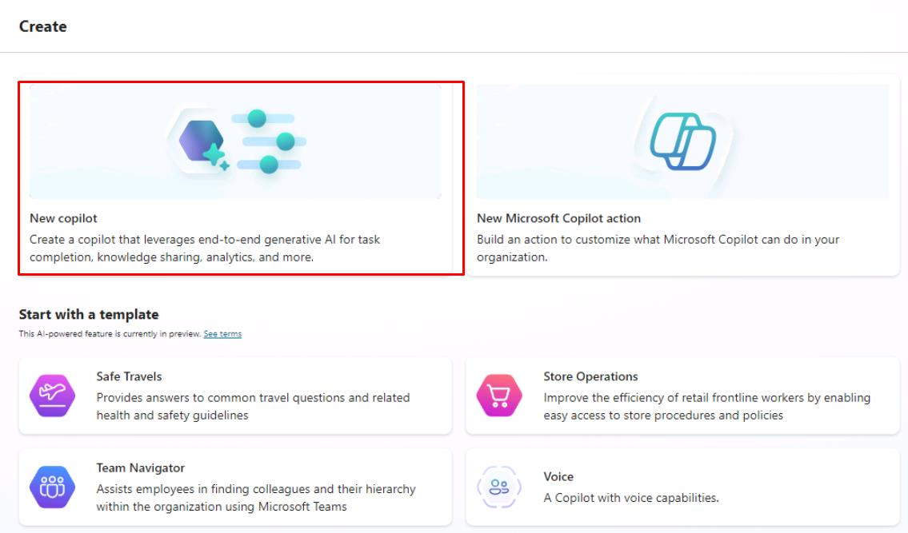
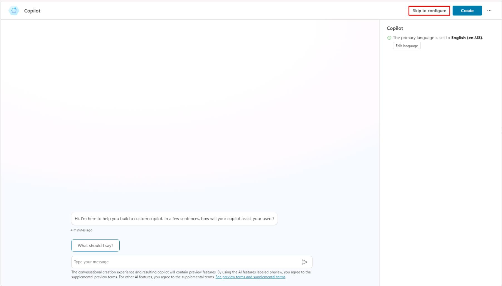
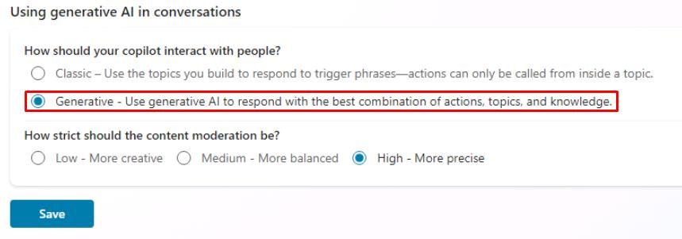

# Task 2: Create a copilot

1. From the **Microsoft Copilot Studio Home** page, describe your copilot to create it by entering the prompt below:

    ```plaintext
    I want to create a copilot for my customer support. It is an assistant for Contoso customers, helping to answer common questions and help with common tasks, like checking an order status.
    ```

    > {: .warning }  
    > If prompted to wait before submitting your request, please wait a few moments and try again. If the issue persists, expand the dropdown below for additional instructions on creating your copilot manually.
    >
    > <details>
    > <summary>Click to expand for more details on manually creating your copilot..</summary>
    >
    > 1. On the left-most pane, select **Create**.  
    >     
    >
    > 2. On the **Create** page, select **New copilot**.  
    >     
    >
    > 3. In the upper-right corner, select +++Skip to configure+++.  
    >     
    >
    > 4. In the upper-right corner, select +++Create+++.
    >
    > 5. In the upper-right corner, select +++Settings+++.  
    >      
    >
    > 6. On the **Settings** pane, select **✨ Generative AI**.
    >
    > 7. Under ***How should your copilot interact with people?***, select **Generative**, then select **Save**.  
    >      
	>
    > 8. Proceed to the next task.
	>
    > </details>

	

	> {: .note }  
	> You will get redirected to a conversational experience to further customize your copilot. You can provide further details to the description (you can decline to do so), and you will also be prompted for a tone of voice.

2. Enter the following prompt into the **Type your message** window.


	```PlainText
	Playful tone, joyful, customer focus, but definitely professional
	```
	>{: .note } You will also get asked for publicly accessible websites to get information from.

1.	Enter the following prompt into the **Type your message** window. 
	
	```PlainText
	Information should come from https://learn.microsoft.com/en-us/microsoft-copilot-studio/ and from https://www.microsoft.com/en-us/microsoft-copilot/
	```

	>{: .note } You will also get asked topics or tasks the copilot shouldn’t help with or talk about.

1. Enter the following prompt into the **Type your message** window. 

	```PlainText
	We don't want to discuss other brands like Fabrikam. Never provide product comparisons with competitor technologies.
	```

1.	When prompted, you can answer +++I’m done+++.

2.	Before you create your copilot, go the **…** and **Edit advanced settings** menu to update the **copilot schema name**.

1. 	 In the **Advanced Settings** window, under Solution, leave the default value of **Common Data Services Default Solution**.

1. 	 In the **Advanced Settings** window, under **Schema Name**, enter +++ContosoCopilot@lab.LabInstance.Id+++.


	>{: . important } Contrary to the copilot display name, the schema name is a technical property that can’t be changed afterwards and must be unique.
	

1.	Select **Save**, then select **Create**.

	!IMAGE[hzdo3ijh.jpg](instructions271830/hzdo3ijh.jpg)


    >{: . important } You can choose to avoid the conversational creation experience by selecting **Skip to configure** You can set the copilot’s primary language in the **Edit language** menu. For the lab, be sure to remain in English (en-US). It is a best practice to always configure your copilot in the context of your own solution and publisher, so that the copilot is created with the desired publisher prefix, and so that you can easily export it and deploy it to other environments.
