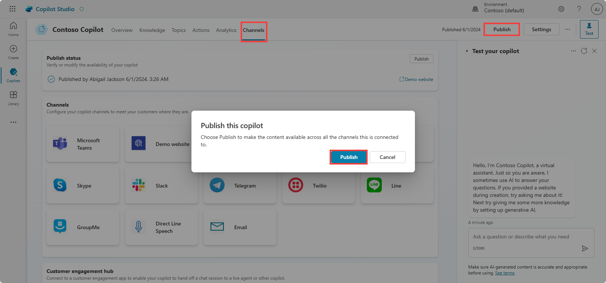
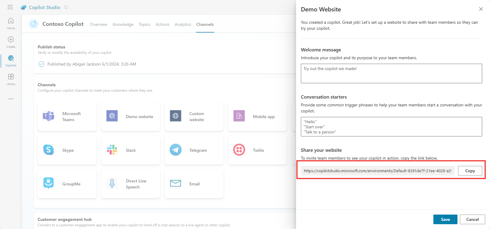

# Publish your copilot to the demo website for testing

## Task 6.1: Change your copilot authentication

For the purposes of this demo, we will set the bot to no authentication so that anyone with a link to the demo site is able to test it. To do this, follow the below steps:

1.	Go to **Settings** in the top-right navigation.

2.	Go to **Security**.

3.	Select **Authentication**.

4.	Select **No authentication** in the panel that opens, then select **Save**.

5.	In the **Save this configuration?** Panel that opens, select **Save**.
	

---

## Task 6.2: Publish your copilot

Microsoft Copilot Studio provides a demo website so that you can invite anyone to test your copilot by sending them the URL. This demo website is useful for gathering feedback to improve your content before you activate the copilot for your real end-users.

1.	In Microsoft Copilot Studio, go to the **Channels** tab.

1.	Select **Publish** to push the latest topics updates to the demo website.
	You will need to complete this action before using the demo website for the first time and after making any changes to the topics you want users to test.
 	

	{: .important }
	>- When you've created your real copilot, you'll publish whenever you want to make updated topics available in your deployed channels.
	>- The publishing process checks for errors in the topics whose Status is **On**. 
	>- Publication should take only a **few minutes**.

	After you've selected the Publish option, a green banner notification will show at the top of the screen when publishing is complete.

	{: .note }
	> Publishing to the demo website is a quick process, but publishing a copilot for real-world use (e.g., in Microsoft Teams) can take longer. For Teams, you may need to initiate an approval workflow as an administrator before the copilot is made available to users in the Teams channel. The publishing process ensures that all updates are properly validated and deployed across the environment.  
	> See here for more details: [Publication fundamentals for publishing channels](https://learn.microsoft.com/en-us/microsoft-copilot-studio/publication-fundamentals-publish-channels?tabs=web)

1.	Select the link for the demo website, as shown in the following screenshot.
 	

1.	When the demo site window opens, you can interact with the copilot by typing at the Type your message prompt or by selecting a starter phrase from the provided options.
 	

Congratulations, you've now built and published your first copilot!

