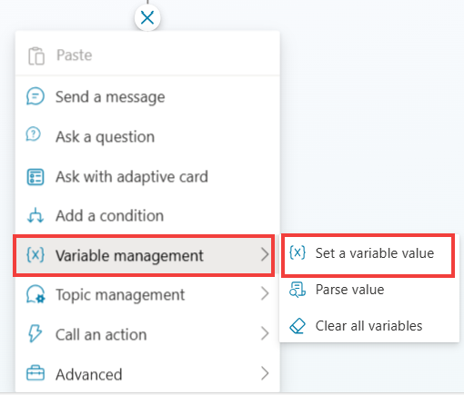
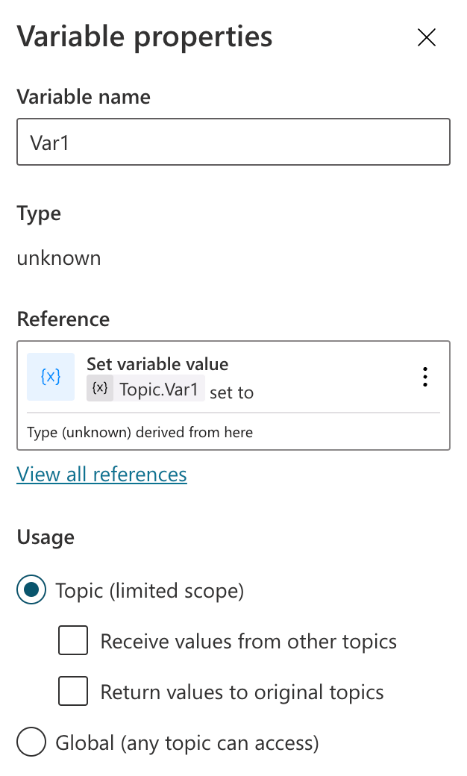
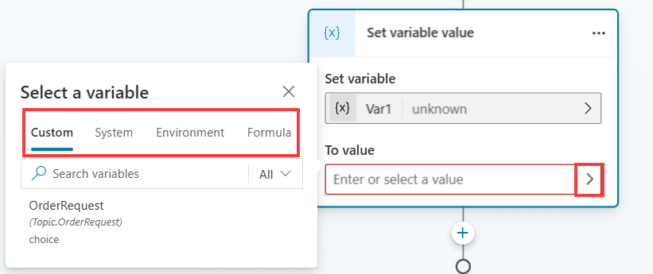
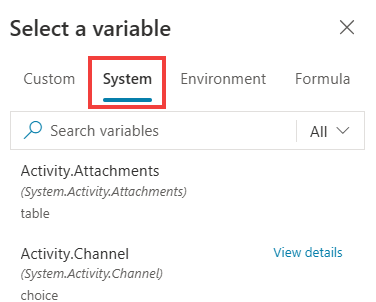

---
title: '4. Learn about variable types'
layout: default
nav_order: 4
parent: 'Exercise 02: Authoring 101'
---

# Variables
 	
You're beginning to enhance the topic that you created in the previous lab. In the previous section, you used entities and slot filling to automatically detect the data from a user's sentence and store specific data in a variable. Now, you'll learn how to use the data that you obtained from the question in a variable and then display it within a message.

## Learn about variable types

Expand here for more details on variable types.

Variables let you save responses from your end-users to help guide the conversation (such as determining whether to provide different instructions for returns based on the purchase price of the item). And you can use them directly in the conversational response from the copilot (for example, "I can help you return your {Topic.ProductName}").

By default, you can only use a variable's value in the topic where the variable is created. However, if you want the copilot to reference the same value across other topics, you can choose to make it a global variable (you might know this concept from other applications). Basically, when the conversation moves to a different topic, the copilot can remember and use variable values that have been filled in from previous topics in the conversation. In Microsoft Copilot Studio, you can set up variables by using Power Fx formulas and functions and outside of a Question node by using the Set a Variable value node.

Different types of variables in Microsoft Copilot Studio include:

- **System** – These variables are normally populated with system data. System variables aren't user-made and are part of the platform. For example, if your copilot requires end-user authentication, system variables may include user ID, email, first name, etc. You can access system variables in the authoring canvas from the variable selection, under System.

- **Topic** – These variables are user-made from either topic Inputs, the Set a Variable Value node, the Question node or as the output of other nodes or actions (e.g., cloud flows, HTTP requests, connectors, custom prompts, plugin actions, etc.). These variables are by default limited in scope and available only in the topic that's being created and no other topics. Two options are available to expand this scope for topic variables if they can receive values from other topics and return values to other topics. With these options set, a topic variable is no longer limited to only being used in the topic, but other topics can use it. You can access Topic variables in the authoring canvas from the variable selection, under Custom.

- **Global** – These variables are user-made and are available from any topic, and they're a good way to store data that multiple topics use to help the conversation, regardless of how many topics are triggered within it. If you embed your copilot in a website or application, you can pass context data (e.g., current page, user language, etc.) as global variables to your copilot, if these are configured to accept external sources to set values for them. You can access Global variables in the authoring canvas from the variable selection, under Custom.

You can use variables in several places, including the Questions, Conditions, and Set Variable Value nodes. The variable can be a custom value that uses Power Fx, a user-entered value, a response from a question, or system variable values.

Use this first exercise to become familiar with the Set variable value node and to review the different types of variables. This task involves creating a new node, creating a new variable, renaming the variable, and determining other variables that you can use within Microsoft Copilot Studio at the system level. At the end of this task, you'll delete this node.

1.	In your topic, create a Set variable node anywhere in the canvas by selecting the add node button. Then, select **Variable management** > **Set a variable value**. This step is for exploring variable options, so it isn't critical that you add the variable in a specific location. It's deleted later.

 	

2.	A new **Set a variable value** node is created. Select the **Select a variable** menu under the **Set variable** section within the node. A flyout panel opens on the side. Select the Create new button.

 	

	- Your new variable is made and is, by default, called Var1 (or a different number if you already created a variable with this name, such as Var2 or Var3).
 	
	 
4.	 Select the name of the variable to open the Variable properties panel on the right side of the screen, where you can rename a variable and change the scope of a variable from Topic or Global.
   	 {: .important }
    	 > **Pro tip**: It's a best practice to ensure that you name your variables to something descriptive based on the data that's being stored. This approach helps you in the future and helps other makers.

   	 

1.	Select the **X** in the upper-right corner of the Variable properties panel to close it. Determine what data you can use to store in the variable. You can use other variables that you created in your authoring canvas, or you can use system variables or formulas. 

1.	On your **Set variable value node**, select the arrow to the right of **To value**. A flyout panel appears that contains separate headings named Custom, System, Environment, and Formula (using Power Fx, which is covered later in this lab).
   
 	

3.	Select the System heading to open the **System** Variable list. Now, you'll be able to view all variables that Microsoft Copilot Studio uses. These variables contain data that Microsoft Copilot Studio populates, and you can also use this data in your own variables. Review these options so that you know what's available by default.

	

5.	Now that you reviewed the options that are available to you within the Set variable node, you can remove this node by selecting the extended menu options and selecting **Delete**, as shown in the following screenshot (it won't be used in the next lab exercises).

	

7.	From anywhere within the authoring canvas, you can also use the Variables window to review all variables within the topic, including global variables. Go to the upper right of the screen and select Variables to view this panel. It's beneficial to review all variables within a topic, especially large topics.

	
