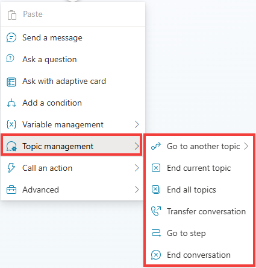

# Use topic nodes

Microsoft Copilot Studio allows authors to redirect to another topic, such as an escalation topic. Typically, topics are set up to trigger based on what users are typing or saying to the Copilot that triggers an intent match, or based on events such as an escalation, conversation start, and other system topics with event-driven triggers. Users can also direct other topics within an authored conversation where it makes sense to do so, or they can perform loops within the current topic to another node.

##  Become familiar with topic type nodes
 	
In the topic that you've been working on during previous exercises for this lab, select the plus **(+)** icon to add a new node and then select **Topic management**. A list of available commands displays, as shown in the following screenshot.

In the **Topic management** menu, you can select from the following options:

•	**Go to another topic** – This node has an extended flyout menu where you can go to another topic that you need to select.

 {: .important }	
 > **Pro tips**:  
 >	- It’s often more manageable to create many bite-size topics rather than a few large topics. Taking this approach also helps making triggering more effective, by clearly mapping trigger phrases to the specific topics that address those areas. 
 >	- As large topics can be challenging to maintain and update, it's a good idea to break down your copilot logic when possible, especially if parts of your bot conversation logic can be shared by multiple topics. This concept is referred to as reusable topics. 
 >	- Topics don’t need to all have trigger phrases, as topics can redirect to other topics and pass variable information back and forth.

•	**End current topic** – Selecting this option ends the current topic. Typically, you'd use this option where the topic was called from another topic. It would be returned to where it was originally called from. You can also use this option in branching conditions. If you select this option to end an entire topic of a branch, the behavior operates similar to the End all topics node.

•	**End all topics** – This node ends all active topics. The next message from the user is considered as a new conversation, and triggers the most appropriate topic based on that user message, starting a new active topic.

•	**Transfer conversation** – Select this option to transfer to an agent and send a contextual message.

•	**Go to step** – Allows a copilot author to navigate to another node in the open topic. This option is useful for looping scenarios or if you want to gather more information from the user.

•	**End conversation** – Sends an endOfConverastion activity. This can be useful for the client chat widget, for examples deployed to your website), to know that the chat session is over.

Now that you're familiar with the basics of the topic management functions, you can practice using the **Go to another topic** node for the next task. The **Go to another topic** node is useful when you want to apply other topics from conditions based on what the user asks for in the dialog.
