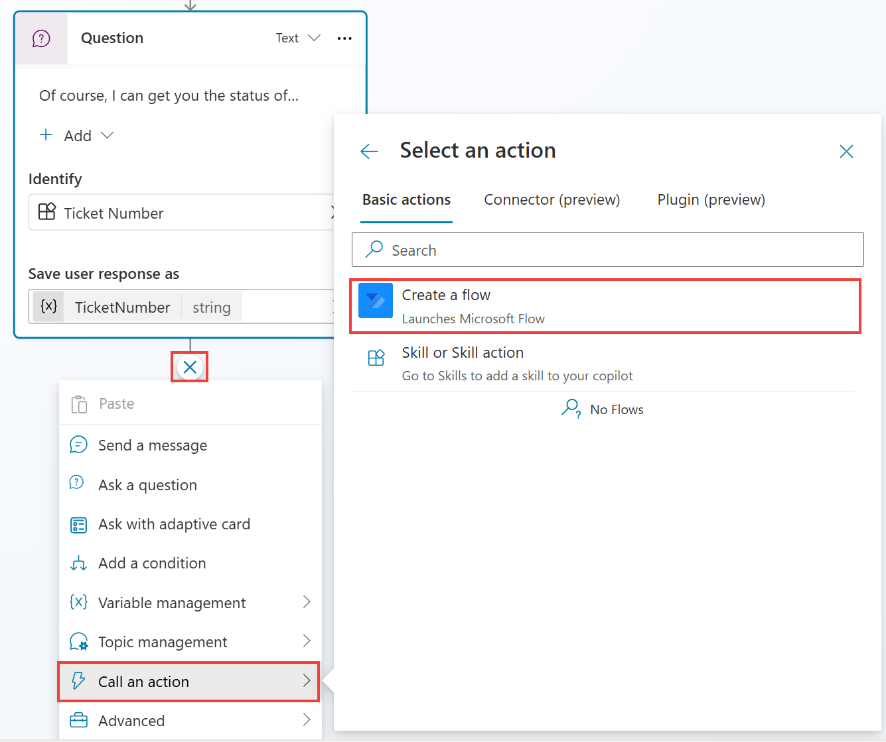
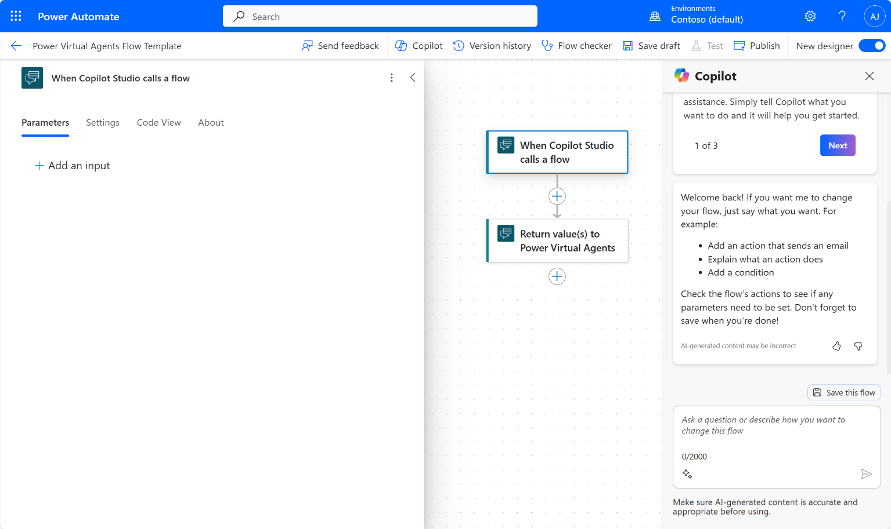
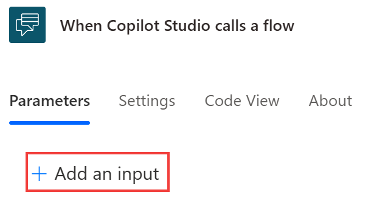
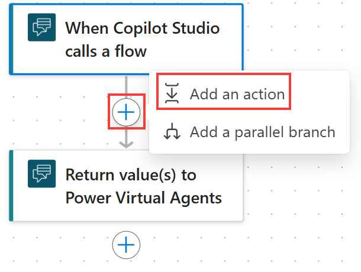
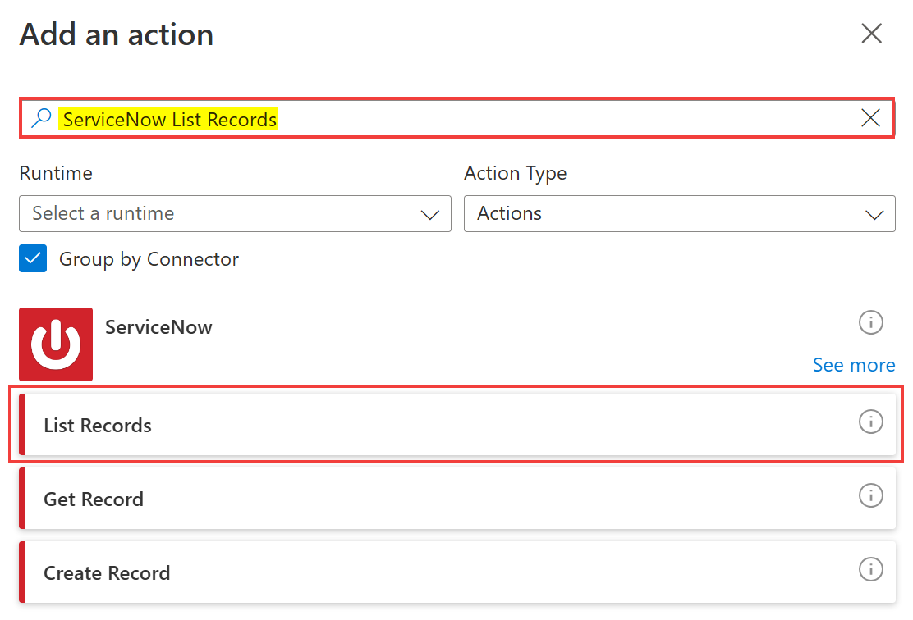
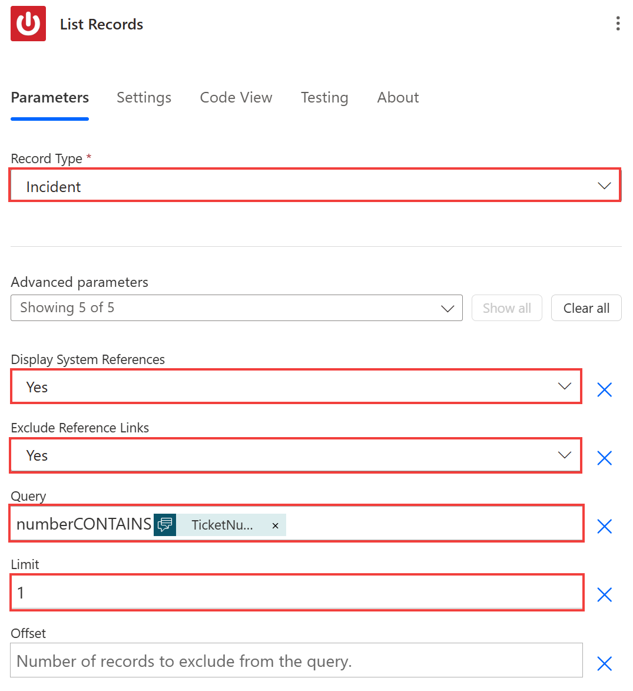
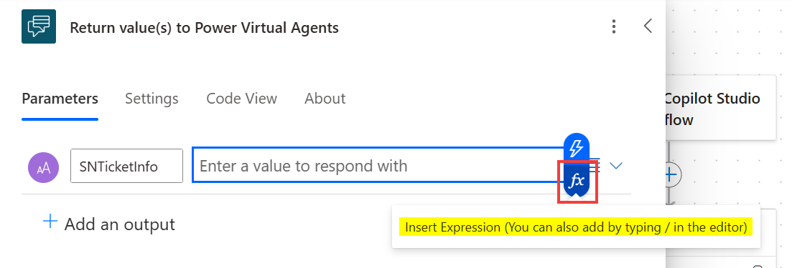
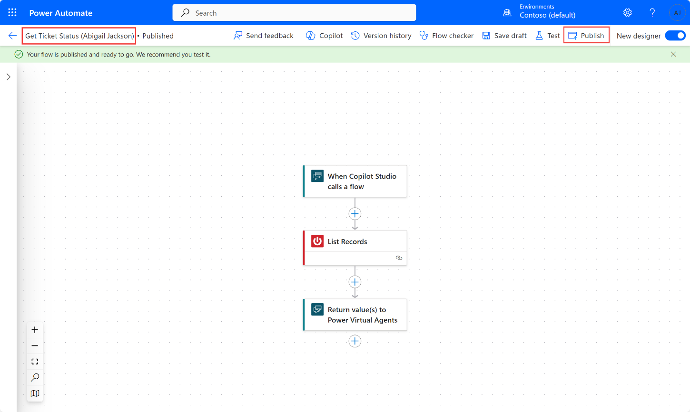

# Create your Power Automate cloud flow

1.	Click on the **(+)** new node button under the **Question** node, and select **Call an action** and then click **Create a flow** underneath **Basic actions** as shown in the screenshot below.
	

1.	This will open **Power Automate** in a new browser window and includes the scaffolding pre and post actions for a new Power Automate cloud flow to interact with Copilot Studio, as shown in the screenshot below:
 	

	{: .important }
	> **Pro tip**: Make sure the New designer is enabled in Power Automate, in the top right corner

1.	Click on the **When Copilot Studio calls a flow** trigger, in the left-hand pane click **Add an input**.
	

1.	Add an input of type Text, and call it **TicketNumber**.
 	   

1.	Click **Add an action** in between the trigger and the action you just added.
 	   

	   {: .warning }
	   > In the next steps, if the ServiceNow environment isn’t active and if the connection cannot be properly established – this is typically the case if the Record Type doesn’t return a list with Incident as an option in step #8 – then skip to step #11.

1.	Search for **ServiceNow List Records** in the search bar and select **List Records**.
 	   

1.	Create a connection for **ServiceNow**. Name the connection to something unique, for example: **@lab.User.FirstName	@lab.User.LastName ServiceNow**.

       - Set the **Instance** to **[https://dev261120.service-now.com](https://dev261120.service-now.com)**

       - Set the **Username** to **CopilotStudioServiceAccount**

       - Set the **Password** to:
	```
 	yz>OyYOz^>LXmg+b%5A)R9dFonXfK&roI70@usD.-&pQMttjJGxjZ5sD^5]_&AXHLiEl^Wwa>.+[6i+e,h+XLz-nbZT,oG>6>?(<
 	```

1.	Then select **Create New**.
	 

1.	Now for **Record Type**, select **Incident** (you can search to make it easier to find Incident in the list).

	- Select **Show all** in **Advanced parameters**.

	- Set the **Display System References** to **Yes** to show actual values.
		
	- Leave the **Exclude Reference** Links to **Yes**.

	- In **Query**, type **numberCONTAINS** and select the **TicketNumber** input from the dynamic content (**⚡icon**).

	   {: .warning }
	   > **Ensure there are no spaces** between **numberCONTAINS** and the **variable** you reference. 
	   > Alternatively, you can also paste the below in the Query field:

	```
  	 numberCONTAINS@{triggerBody()?['text']}
  	 ```

1.	Set Limit to 1.
	   

1.	Click on the **Return value(s) to Power Virtual Agents** action in the cloud flow and add an **output** of type **Text** and call it **SNTicketInfo**.

1.	For the output **value**, use the formula button **𝒇𝓍** in order to get a string version of the first returned record of the result array from the List Records body.

1.	**Enter** the following formula, and select **Add**.

	**string(first(outputs('List_Records')?['body/result']))**
	   
	   

1.	**Optional step (if ServiceNow isn’t working):** for the output value, paste a the below hardcoded payload.

	   {: .note }
	   > This represents an example of what ServiceNow would typically return.

	   {: .important }
	   > If you struggle copying the below text, go to **F:\LabFiles\Misc** and open the ServiceNow Sample JSON Payload.txt

	```json
	{
		"parent": "",
		"made_sla": "true",
		"caused_by": "",
		"watch_list": "",
		"upon_reject": "Cancel all future Tasks",
		"sys_updated_on": "2018-12-12 23:18:55",
		"child_incidents": "0",
		"hold_reason": "",
		"origin_table": "",
		"task_effective_number": "INC0009005",
		"approval_history": "",
		"number": "INC0009005",
		"resolved_by": "",
		"sys_updated_by": "admin",
		"opened_by": "System Administrator",
		"user_input": "",
		"sys_created_on": "2018-08-31 21:35:45",
		"sys_domain": "global",
		"state": "New",
		"route_reason": "",
		"sys_created_by": "admin",
		"knowledge": "false",
		"order": "",
		"calendar_stc": "",
		"closed_at": "",
		"cmdb_ci": "",
		"delivery_plan": "",
		"contract": "",
		"impact": "1 - High",
		"active": "true",
		"work_notes_list": "",
		"business_service": "",
		"business_impact": "",
		"priority": "1 - Critical",
		"sys_domain_path": "/",
		"rfc": "",
		"time_worked": "",
		"expected_start": "",
		"opened_at": "2018-08-31 21:35:21",
		"business_duration": "",
		"group_list": "",
		"work_end": "",
		"caller_id": "David Miller",
		"reopened_time": "",
		"resolved_at": "",
		"approval_set": "",
		"subcategory": "Email",
		"work_notes": "2018-12-12 23:18:42 - System Administrator (Work notes)\nupdated the priority to high based on the criticality of the Incident.\n\n",
		"universal_request": "",
		"short_description": "Email server is down.",
		"correlation_display": "",
		"delivery_task": "",
		"work_start": "",
		"assignment_group": "",
		"additional_assignee_list": "",
		"business_stc": "",
		"cause": "",
		"description": "Unable to send or receive emails.",
		"origin_id": "",
		"calendar_duration": "",
		"close_notes": "",
		"notify": "Do Not Notify",
		"service_offering": "",
		"sys_class_name": "Incident",
		"closed_by": "",
		"follow_up": "",
		"parent_incident": "",
		"sys_id": "ed92e8d173d023002728660c4cf6a7bc",
		"reopened_by": "",
		"incident_state": "New",
		"urgency": "1 - High",
		"problem_id": "",
		"company": "",
		"reassignment_count": "0",
		"activity_due": "2018-12-13 01:18:55",
		"assigned_to": "",
		"severity": "3 - Low",
		"comments": "",
		"approval": "Not Yet Requested",
		"sla_due": "UNKNOWN",
		"comments_and_work_notes": "2018-12-12 23:18:42 - System Administrator (Work notes)\nupdated the priority to high based on the criticality of the Incident.\n\n",
		"due_date": "",
		"sys_mod_count": "3",
		"reopen_count": "0",
		"sys_tags": "",
		"escalation": "Normal",
		"upon_approval": "Proceed to Next Task",
		"correlation_id": "",
		"location": "",
		"category": "Software"
	}
	```

1.	The cloud flow is almost complete. It needs to be **renamed** before we move on to best practices, so it is easily found in Copilot Studio and by administrators.

1.	Click the template **title** as shown in the screenshot below and rename it to **Get Ticket Status {YourUserName}**.

1.	Click **Publish** and wait a moment until you see the green banner as shown in the screenshot below.

	   {: .important }
	   > **Pro tip**: If you don’t see the Publish button, select Save.

	   

We have completed our work in Power Automate. Now let’s switch back to Copilot Studio.
