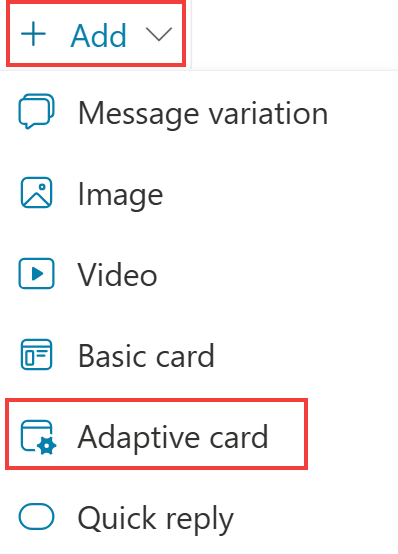
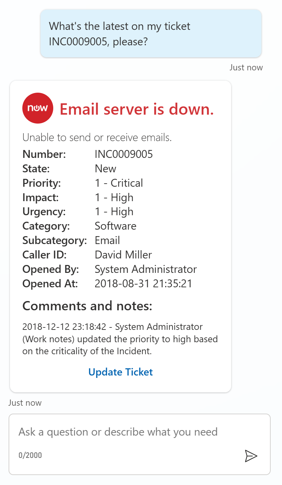

# Display the ServiceNow ticket information in an adaptive card

1.	Go to your **Check Ticket Status** topic.

3.	**Delete** the text message variable for your message.

 	

4.	Select **Add, Adaptive Card**.

 	

5.	Toggle from **Edit JSON** to **Formula**, so that you can make the adaptive card dynamic and author it in Power Fx language.

 	

6.	Paste the below Power Fx formula that already contains the references to the ServiceNow ticket information

    >{: . important }	If you struggle copying the below text, go to +++F:\LabFiles\Misc+++ and open the ServiceNow Adaptive Card Power Fx.txt

	```json
	{
	type: "AdaptiveCard",
	version: "1.5",
	body: [
		{
		type: "ColumnSet",
		columns: [
			{
			type: "Column",
			width: "auto",
			items: [
				{
				type: "Image",
				url: "https://www.servicenow.com/community/s/legacyfs/online/avatars_servicenow/1f66cb9fdb3ee3c0107d5583ca961942.jpg",
				size: "Small",
				style: "Person"
				}
			]
			},
			{
			type: "Column",
			width: "stretch",
			items: [
				{
				type: "TextBlock",
				text: Topic.SNTicketInfoParsed.short_description,
				weight: "Bolder",
				size: "Large",
				wrap: true,
				color: "Attention",
				horizontalAlignment: "Left"
				}
			],
			verticalContentAlignment: "Center",
			horizontalAlignment: "Center"
			}
		]
		},
		{
		type: "TextBlock",
		text: Topic.SNTicketInfoParsed.description,
		weight: "Lighter",
		wrap: true
		},
		{
		type: "FactSet",
		facts: [
			{
			title: "Number:",
			value: Topic.SNTicketInfoParsed.number
			},
			{
			title: "State:",
			value: Topic.SNTicketInfoParsed.state
			},
			{
			title: "Priority:",
			value: Topic.SNTicketInfoParsed.priority
			},
			{
			title: "Impact:",
			value: Topic.SNTicketInfoParsed.impact
			},
			{
			title: "Urgency:",
			value: Topic.SNTicketInfoParsed.urgency
			},
			{
			title: "Category:",
			value: Topic.SNTicketInfoParsed.category
			},
			{
			title: "Subcategory:",
			value: Topic.SNTicketInfoParsed.subcategory
			},
			{
			title: "Caller ID:",
			value: Topic.SNTicketInfoParsed.caller_id
			},
			{
			title: "Opened By:",
			value: Topic.SNTicketInfoParsed.opened_by
			},
			{
			title: "Opened At:",
			value: Topic.SNTicketInfoParsed.opened_at
			}
		],
		spacing: "Small"
		},
		{
		type: "TextBlock",
		text: "Comments and notes:",
		weight: "Bolder",
		size: "Medium",
		wrap: true
		},
		{
		type: "TextBlock",
		text: Topic.SNTicketInfoParsed.comments_and_work_notes,
		wrap: true,
		size: "Small"
		}
	],
	actions: [
		{
		type: "Action.OpenUrl",
		title: "Update Ticket",
		url: "https://dev204932.service-now.com/nav_to.do?uri=incident.do?sys_id=" & Topic.SNTicketInfoParsed.sys_id & "%26sysparm_view=ess"
		}
	],
	'$schema': "http://adaptivecards.io/schemas/adaptive-card.json"
	}

	```

1.	**Save**.


2.	**Test** your copilot.

2. Enter the following prompt:

	+++What's the latest on ticket INC0007001, please?+++

    

## Summary

Thank you for completing Exercise 3 ‘Build and call Power Automate cloud flows from your copilot’. You have successfully:

•	Created a new Power Automate cloud flow

•	Called the Power Automate cloud flow into your topic

•	Set input and output variables

•	Displayed dynamic data back to the user in Copilot Studio

