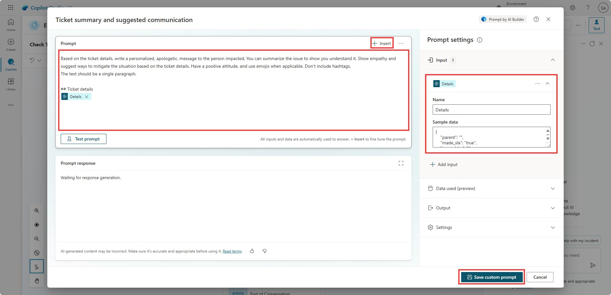

# Task 2: Create a prompt

1. Go to **Topics**, and open **Check Ticket Status**.

1. After the **last message** that contained an Adaptive Card, add **another node** with the (+) button.

	{: .note }
	> After pressing the (+) button, choose **Call an action** and select **Create a prompt** (view screenshot below).

	

1. Give it a name **Ticket customer communication**.

1. Add an **Input**, called **Ticket Details**.

1. In the Prompt, paste the below instructions:

1. **Under** the **## Ticket details** section, use the **Insert** button to select the **Details** input.

1. Under **Settings**, choose **Model GPT-4 (preview)**.

	

1. Select **Save custom prompt**.

1. Select the **SNTicketInfo** variable for the **Details input**.

1. Create a variable for the generated output: **PersonalizedMessage**

	

1. Add a **Message** node, and insert the **PersonalizedMessage.text** variable.

	

1. Select **Save**.

1. **Test** by entering the following prompt:

	**What's the latest on ticket INC0007001, please?**

	

## Summary

Thank you for completing Exercise 7 ‘Use generative AI orchestration to interact with your connectors’. 
You have successfully:

•	Created a custom prompt from Copilot Studio

•	Passed it inputs and used its output as a generated answer for the end-user
